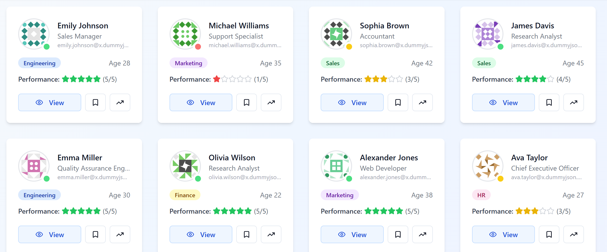
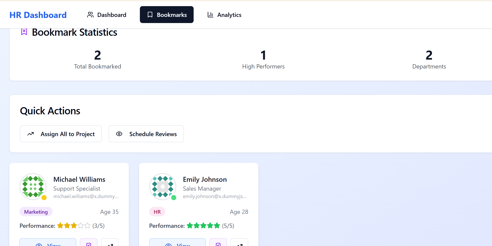

# HR Boost Dashboard
Public Repo Link
https://github.com/biswasroshan/hr-boost-dashboard


A modern HR management dashboard built with React and TypeScript, designed to streamline HR operations and improve employee management.

## Features

- **Employee Management**
  
  - View and manage employee profiles
  - Track employee attendance and leave
  - Performance monitoring and reviews

- **Dashboard Analytics**
  
  - Real-time HR metrics and KPIs
  - Department-wise analytics
  - Employee engagement insights

- **Document Management**
  
  - Secure storage of employee documents
  - Automated document generation
  - Digital signature support

- **User Management**
  
  - Role-based access control
  - Secure authentication
  - User activity tracking

## Project Setup

### Prerequisites

- Node.js (v16 or higher)
- npm (v7 or higher)
- Git

### Installation

1. **Clone the repository**
   ```sh
   git clone <YOUR_GIT_URL>
   cd hr-boost-dashboard
   ```

2. **Install dependencies**
   ```sh
   npm install
   ```

3. **Environment Setup**
   - Create a `.env` file in the root directory
   - Add necessary environment variables (see `.env.example`)

4. **Start development server**
   ```sh
   npm run dev
   ```
   The application will be available at `http://localhost:5173`

### Build for Production

```sh
npm run build
```

The build artifacts will be stored in the `dist/` directory.

## Technologies Used

This project is built with:

- **Frontend Framework**: React with TypeScript
- **Build Tool**: Vite
- **Styling**: Tailwind CSS
- **UI Components**: shadcn-ui
- **State Management**: React Context API
- **Form Handling**: React Hook Form
- **API Integration**: Axios
- **Code Quality**: ESLint, Prettier

## Contributing

1. Fork the repository
2. Create your feature branch (`git checkout -b feature/amazing-feature`)
3. Commit your changes (`git commit -m 'Add some amazing feature'`)
4. Push to the branch (`git push origin feature/amazing-feature`)
5. Open a Pull Request
